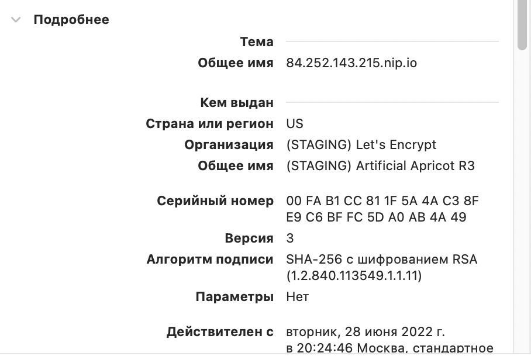
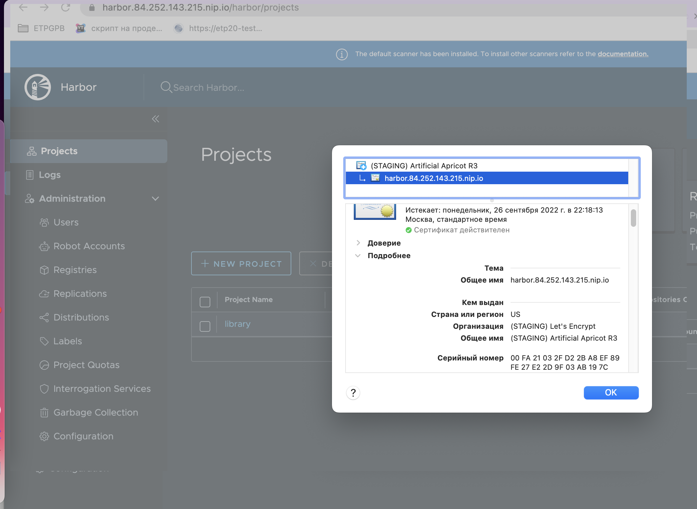

# Выполнено ДЗ № 6

- [ ] Основное ДЗ **cert-manager**


*To automatically install and manage the CRDs as part of your
Helm release, you must add the --set installCRDs=true flag to your Helm installation command.*

В соответвии с документацией можно использовать *--set installCRDs=true* вместо
*kubectl apply -f https://github.com/cert-manager/cert-manager/releases/download/v1.8.2/cert-manager.crds.yaml*


```shell
mkdir -p kubernetes-templating/cert-manager 
cd kubernetes-templating/cert-manager 
kubectl create namespace=cert-manager
kubectl get namespace cert-manager -o yaml >> cert-manager.yaml
helm install my-release --namespace cert-manager \
  --version v1.8.2 jetstack/cert-manager --set installCRDs=true
```
```shell
kubectl apply -f issuer.yaml 
```

```shell
kubectl get pods --namespace cert-manager
NAME                                                 READY   STATUS    RESTARTS   AGE
my-release-cert-manager-7d77899bb5-fq2pt             1/1     Running   0          32m
my-release-cert-manager-cainjector-6bbdcbb58-9kfc6   1/1     Running   0          32m
my-release-cert-manager-webhook-7f667bdb9c-t84tn     1/1     Running   0          32m
```

```shell
kubectl apply -f test-resources.yaml 
kubectl describe certificate -n cert-manager-test
```

```text
...
Spec:
  Dns Names:
    example.com
  Issuer Ref:
    Name:       test-selfsigned
  Secret Name:  selfsigned-cert-tls
Status:
  Conditions:
    Last Transition Time:  2022-06-28T16:41:29Z
    Message:               Certificate is up to date and has not expired
...
Events:
  Type    Reason     Age   From                                       Message
  ----    ------     ----  ----                                       -------
  Normal  Issuing    18s   cert-manager-certificates-trigger          Issuing certificate as Secret does not exist
  Normal  Generated  18s   cert-manager-certificates-key-manager      Stored new private key in temporary Secret resource "selfsigned-cert-5tdmw"
  Normal  Requested  18s   cert-manager-certificates-request-manager  Created new CertificateRequest resource "selfsigned-cert-7wk7d"
  Normal  Issuing    18s   cert-manager-certificates-issuing          The certificate has been successfully issued

```

```shell
kubectl delete -f test-resources.yaml
```

- [ ] Основное ДЗ **chartmuseum**


```shell
mkdir -p kubernetes-templating/chartmuseum
cd kubernetes-templating/chartmuseum
curl  https://raw.githubusercontent.com/helm/charts/390ee6614b4bb0da96b397f9b382e3ddca9f59a4/stable/chartmuseum/values.yaml >> values.tmp.yaml
touch values.yaml
#update values.yaml
kubectl create ns chartmuseum
kubectl get namespace chartmuseum -o yaml >> chartmuseum.yaml
helm repo add chartmuseum https://chartmuseum.github.io/charts
helm install my-chartmuseum chartmuseum/chartmuseum \
    --namespace=chartmuseum \
    --version 3.8.0 \
    -f values.yaml
```
```shell
kubectl get secrets -n chartmuseum
NAME                                               TYPE                                  DATA   AGE
chartmuseum.84.252.143.215.nip.io                  kubernetes.io/tls                     2      10m
```


- [ ] Задание со * **chartmuseum**

Необходимо добавить *--set env.open.DISABLE_API=false* или
```text
env:
  open:
    DISABLE_API: false
```
```shell
helm create firstchart 
cd firstchart 
#update
helm package .
curl -L --data-binary @firstchart-0.1.0.tgz  https://chartmuseum.84.252.143.215.nip.io/api/charts 
#{"saved":true}
#add to helm
helm repo add chartmuseum_local https://chartmuseum.84.252.143.215.nip.io/
helm install chartmuseum_local/firstchart --generate-name
```

- [ ] Основное ДЗ **harbor**

```shell
mkdir -p kubernetes-templating/harbor
cd kubernetes-templating/harbor
kubectl create ns harbor
helm repo add harbor https://helm.goharbor.io #vpn only
helm install my-harbor harbor/harbor \
    --namespace=harbor \
    -f values.yaml
#helm uninstall my-harbor
kubectl get secrets -n harbor -l owner=helm
NAME                              TYPE                 DATA   AGE
sh.helm.release.v1.my-harbor.v1   helm.sh/release.v1   1      2m36s

```



- [ ] Основное ДЗ **hipster-shop**
```text
.
├── frontend
│   ├── Chart.yaml
│   ├── charts
│   ├── templates
│   │   ├── deployment.yaml
│   │   ├── ingress.yaml
│   │   └── service.yaml
│   └── values.yaml
└── hipster-shop
    ├── Chart.lock
    ├── Chart.yaml
    ├── charts
    │   ├── frontend-0.1.0.tgz
    │   └── redis-16.13.1.tgz
    └── templates
        └── all-hipster-shop.yaml


```
```text
dependencies:
- name: frontend
  version: 0.1.0
  repository: "file://../frontend"
```

- [ ] Задание со * **REDIS**

```text
dependencies:
- name: redis
  version: 16.13.1
  repository: https://charts.bitnami.com/bitnami
```
```shell
#Push chart example
helm plugin install https://github.com/chartmuseum/helm-push
helm cm-push -u **** -p **** charts/frontend-0.1.0.tgz selflibrary
#helm install my-selflibrary-front selflibrary/frontend \
#     --version 0.1.0 --namespace=***
```
- [ ] Задание со * **helm-secrets**

  kubernetes-templating/frontend/secrets.yaml.dist

- [ ] Основное ДЗ **kubecfg**

```shell
kubecfg
├── paymentservice-deployment.yaml
├── paymentservice-service.yaml
├── shippingservice-deployment.yaml
└── shippingservice-service.yaml
```

```shell
kubecfg version
kubecfg version: v0.26.0
jsonnet version: v0.18.0
client-go version: v0.0.0-master+$Format:%H$
```

- [ ] Задание со * **qbec**  or **Kapitan**

не обязательное, не выполнялось

- [] Самостоятельное Kustomize
```shell
kustomize % tree
.
├── base        
│   ├── deployment.yaml
│   ├── kustomization.yaml
│   └── service.yaml
└── overrides
    ├── develop
    │   └── kustomization.yaml
    └── production
        ├── kustomization.yaml
        ├── memory.yaml
        └── replicas.yaml

```

## PR checklist:
- [ kubernetes-templating  ] Выставлен label с темой домашнего задания

