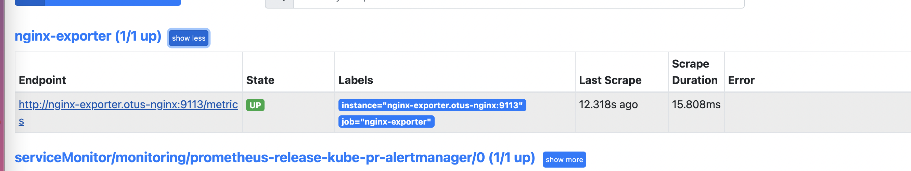
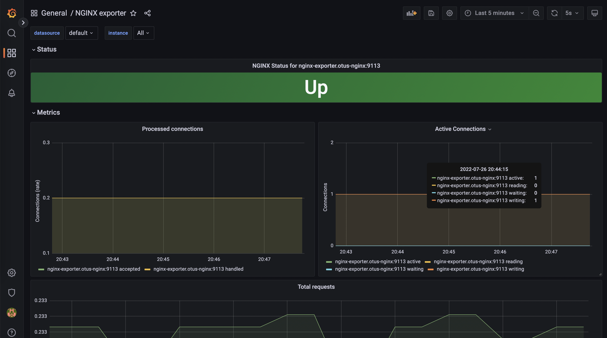

# Выполнено ДЗ № 7

- [ ] Основное ДЗ

```shell
kubectl create ns otus-nginx
cd  otus_nginx
helm install nginx-install --namespace=otus-nginx .
kubectl get pods --namespace=otus-prometheus
NAME                          READY   STATUS    RESTARTS   AGE
otus-nginx-754d96f89d-7n55b   1/1     Running   0          60s
otus-nginx-754d96f89d-9xh4p   1/1     Running   0          60s
otus-nginx-754d96f89d-gw868   1/1     Running   0          3m11s

```
```shell
helm repo add nexclipper https://nexclipper.github.io/helm-charts
helm repo update
helm install nginx-exporter  nexclipper/nginx-exporter --namespace=otus-nginx --set nginxServer=http://otus-nginx.otus-nginx/basic_status
```
```text
  additionalScrapeConfigs:
    enabled: true
    type: internal
    external:
      ## Name of the secret that Prometheus should use for the additional scrape configuration
      ##
      name: ""
      ## Name of the key inside the secret to be used for the additional scrape configuration.
      ##
      key: ""
    internal:
      jobList:
        - job_name: 'nginx-exporter'
          # metrics_path defaults to '/metrics'
          # scheme defaults to 'http'.
          static_configs:
            - targets: [ 'nginx-exporter.otus-nginx:9113' ]
```
OR USE ServiceMonitor.yaml
```shell
kubectl create ns monitoring
helm upgrade --install prometheus-release bitnami/kube-prometheus \
    --namespace=monitoring \
    -f prometheus/values.yaml
```


```shell
helm repo add grafana https://grafana.github.io/helm-charts
helm upgrade --install grafana-release grafana/grafana --namespace=monitoring
```
add Data Sources / Prometheus
http://prometheus-release-kube-pr-prometheus.monitoring:9090

import [NGINX exporter](https://grafana.com/grafana/dashboards/12708) dashboard

## PR checklist:
- [ kubernetes-monitoring ] Выставлен label с темой домашнего задания

